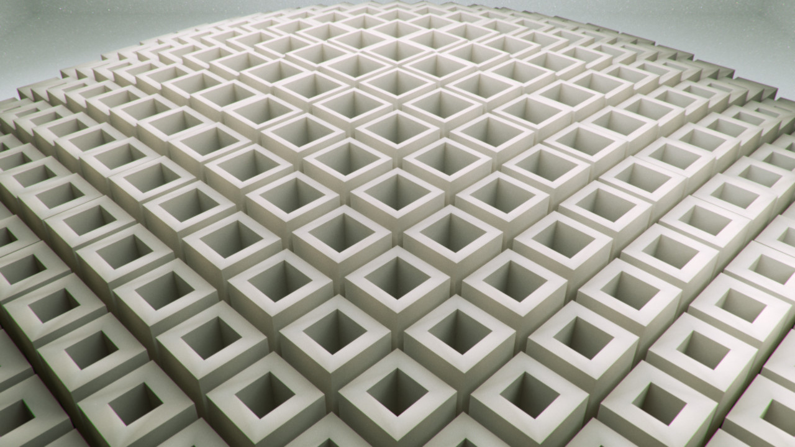

# thi.ng/luxor



This project is part of the [thi.ng](https://github.com/thi-ng/)
collection of Clojure & Clojurescript libraries.

Luxor is a Clojure based LXS scene graph compiler, generator & mesh
exporter for [Luxrender](http://luxrender.net) (v1.3+), an
open source, physically based and unbiased rendering engine.

## Status

ALPHA quality, docs forthcoming. Note, only the most commonly used Lux
functionality is implemented thus far, but more feature support is
planned. All Lux entity generators use the same default values as
specified in the official LXS syntax reference:

http://www.luxrender.net/wiki/Scene_file_format_dev

Since Luxrender has *a lot* of options for its various scene
components, it is highly recommended to study the above reference in
order to customize defaults and obtain high quality renders.

## Dependencies

- [thi.ng/common](https://github.com/thi-ng/common/)
- [thi.ng/geom](https://github.com/thi-ng/geom/)

## Example usage

Leiningen coordinates:

```clj
[thi.ng/luxor "0.2.0"]
```

The code below is responsible for the example image above. To run,
just clone this repo, launch a REPL and load example:

```clj
(load-file "examples/test-scene.clj")
```

The resulting LXS scene file and meshes are saved in the project root
dir. Double click the LXS file to launch in Luxrender.

```clj
(require
 '[thi.ng.luxor.core :refer :all]
 '[thi.ng.geom.core :as g]
 '[thi.ng.geom.aabb :as a]
 '[thi.ng.geom.rect :as r]
 '[thi.ng.geom.polygon :as p]
 '[thi.ng.geom.gmesh :as gm]
 '[thi.ng.common.math.core :as m])

;; see LXS syntax ref for description of these entities & options
;; http://www.luxrender.net/wiki/Scene_file_format_dev

(->
 ;; empty default lux scene
 (lux-scene)

 ;; customize sampler & renderer
 (renderer-sampler)
 (sampler-ld {})
 (integrator-bidir {})

 ;; camera setup
 (camera {:eye [5 -5 5] :target [0 0 0] :up [0 0 1]})
 ;; film size, color response profile, progress updates, stop condition
 (film {:width 1280 :height 720 :response :agfachrome-rsx2-200cd
        :display-interval 5 :halt-spp 1000})
 ;; tonemap config
 (tonemap-linear {:iso 100 :exposure 0.5 :f-stop 8 :gamma 2.2})

 ;; define medium with milky consistency (used for material below)
 (volume
  :inside {:type :clear :absorb [0.97 0.8 0.7] :abs-depth 0.05 :ior 2.04})
 ;; semi-translucent material w/ above medium as interior
 (material-matte-translucent
  :milk {:interior :inside :reflect [0.3 0.3 0.3] :transmit [0.8 0.7 0.6]})
 ;; standard matt white for background/room box
 (material-matte :white {:diffuse [0.8 0.8 0.8]})

 ;; studio light setup: 1x top light, 2x left/right fillers
 ;; we assign them to light groups so they can be tweaked or disabled
 ;; in Luxrender during rendering...
 (light-groups {:top {:gain 40.0} :fill {:gain 5.0}})
 (area-light :top   {:p [0 0 5] :size [8 8] :group :top})
 (area-light :left  {:p [-3 0 4] :size [2 4] :group :fill
                     :tx {:translate [-3 0 0] :ry -30}})
 (area-light :right {:p [3 0 4] :size [2 3] :group :fill
                     :tx {:translate [3 0 0] :ry 30}})

 ;; add scene geometries:
 ;; room box to trap light
 (ply-mesh :room {:material :white
                  :tx {:translate [0 0 8] :scale 16 :rz 45}
                  :mesh (-> (a/aabb 1) (g/center) (g/as-mesh))})
 ;; 16x16 grid of boxes
 ;; takes a single rect, subdivides it into 256 smaller rects
 ;; then extrudes each individually as walled mesh
 ;; and re-combines into single mesh
 ;; extrusion height and wall thickness is based on distance to center
 ;; and passed through cosine fn
 (ply-mesh
  :grid {:material :milk
         :tx {:translate [0 0 0.1] :scale [2 2 1]}
         :mesh (->> (-> (r/rect 5) (g/center) (g/subdivide {:num 16}))
                    (map
                     #(-> (g/scale-size % 0.9)
                          (g/as-polygon)
                          (g/extrude-shell
                           (let [d (-> (g/centroid %)
                                       (g/mag)
                                       (m/map-interval [0 3.75] [0 m/HALF_PI])
                                       (Math/cos))]
                             {:depth (* 2 d) :wall (- 0.15 (* d 0.125))}))))
                    (reduce g/into-mesh))})

 ;; finally serialize & output LXS scene files and meshes
 ;; the `false` arg means materials, objects and volumes
 ;; are included in the main scene file and not written as separate files
 (serialize-scene "luxor-test" true)
 (export-scene))
```
